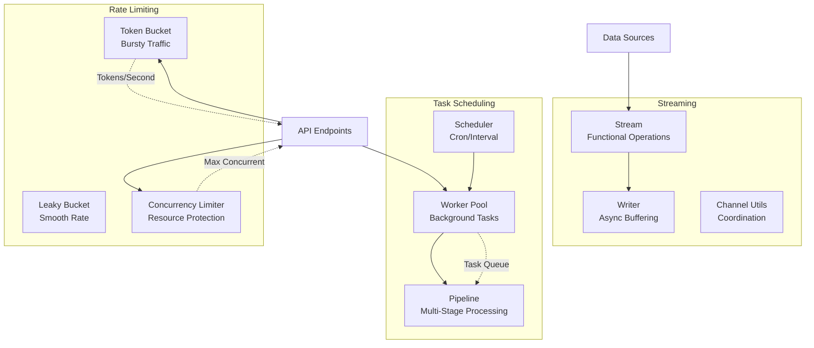
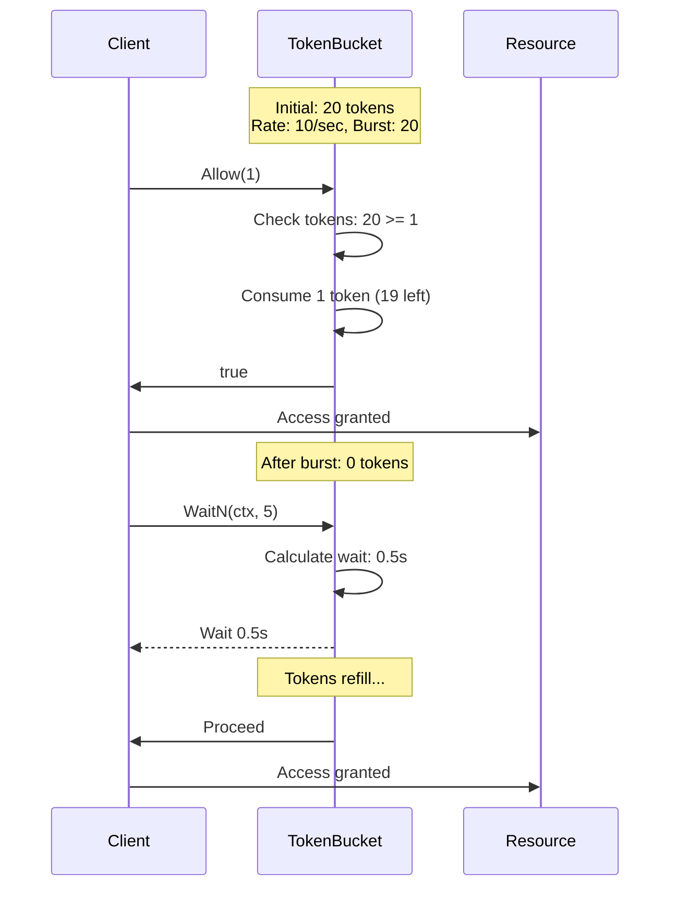
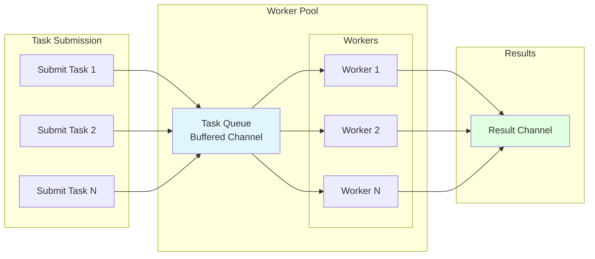
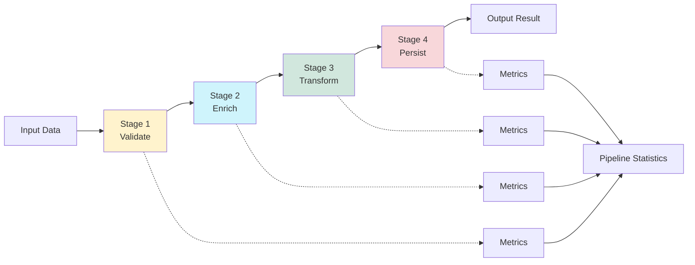
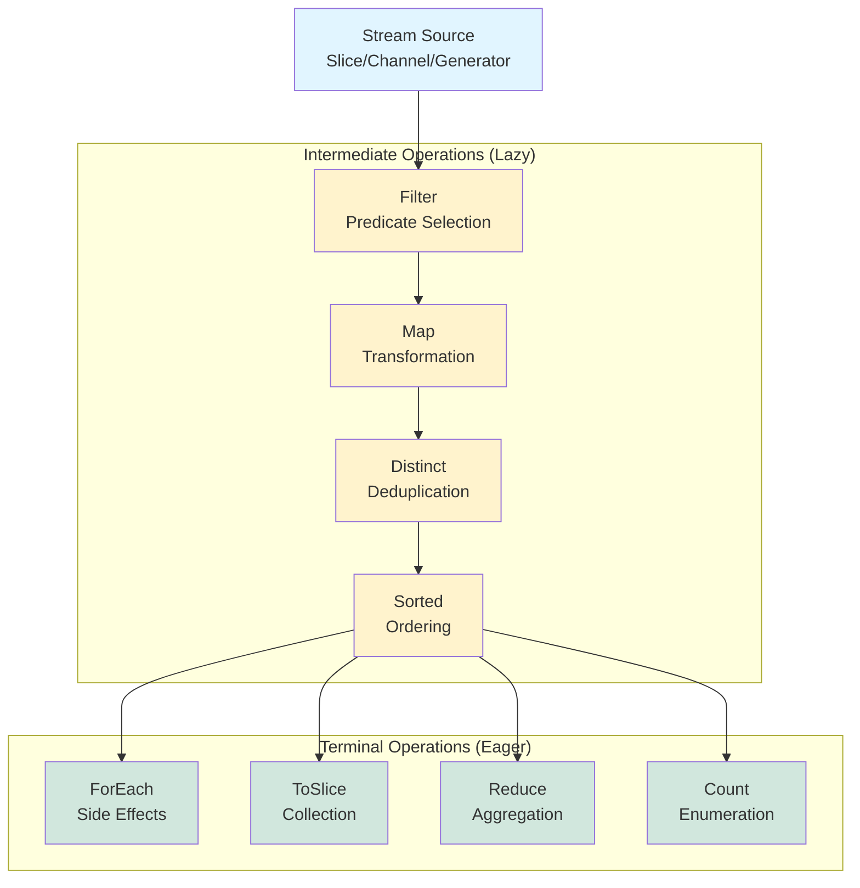

# Building Robust Concurrent Systems in Go: A Practical Approach

## Introduction

Modern applications demand concurrency to handle thousands of simultaneous operations, but implementing reliable concurrent systems is notoriously difficult. Rate limiting prevents resource exhaustion, worker pools manage background tasks, and stream processing handles data pipelines. Each of these requires careful coordination of goroutines, channels, and context cancellation.

goflow addresses these challenges by providing production-ready concurrency primitives that handle the difficult edge cases: graceful shutdown, context propagation, backpressure, and resource protection. Rather than reimplementing token buckets or worker pools for each project, developers can compose these primitives into reliable concurrent systems.

## Problem Space

Three common concurrency challenges plague Go applications:

**Resource Protection**: API endpoints need rate limiting to prevent abuse. Database connections require concurrency limits to avoid exhaustion. CPU-intensive operations must be throttled to maintain system responsiveness.

**Background Processing**: Web services queue background tasks. Batch jobs process data asynchronously. Scheduled maintenance runs periodically. Each requires worker coordination, timeout handling, and graceful shutdown.

**Data Pipelines**: Streaming data flows through validation, enrichment, and persistence stages. Each stage must handle errors, apply backpressure, and process elements efficiently without blocking.

Implementing these patterns correctly requires managing goroutine lifecycles, handling cancellation propagation, coordinating shutdown sequences, and preventing resource leaks. Most implementations get these details wrong.

## Architecture Overview

goflow provides three core modules that compose together:



### Token Bucket Rate Limiter

The token bucket algorithm allows burst traffic while enforcing average rate limits. Tokens accumulate at a fixed rate up to a burst capacity. Each operation consumes tokens. When tokens are available, requests proceed immediately. When exhausted, requests either wait or fail.



### Worker Pool Architecture

Worker pools manage a fixed number of goroutines processing tasks from a bounded queue. This prevents goroutine explosions while providing backpressure through queue capacity.



Each worker runs independently, pulling tasks from the shared queue. Context cancellation propagates to all workers for coordinated shutdown. Panics are recovered and reported as errors.

### Pipeline Processing

Pipelines chain stages together, passing output from one stage as input to the next. Each stage can transform data, perform validation, or trigger side effects.



Pipelines track execution time and errors for each stage. This enables debugging slow stages and understanding failure modes.

### Stream Processing

Streams provide functional operations (map, filter, reduce) over data sources. Operations are lazy, executing only when terminal operations consume the stream.



## Code Examples

### Rate Limiting API Endpoints

Protect API endpoints from abuse by limiting request rates:

```go
package main

import (
    "net/http"
    "github.com/vnykmshr/goflow/pkg/ratelimit/bucket"
)

func main() {
    // 100 requests per second, burst of 200
    limiter, _ := bucket.NewSafe(100, 200)

    http.HandleFunc("/api/data", func(w http.ResponseWriter, r *http.Request) {
        if !limiter.Allow() {
            http.Error(w, "Rate limit exceeded", http.StatusTooManyRequests)
            return
        }

        // Process request
        w.Write([]byte("Success"))
    })

    http.ListenAndServe(":8080", nil)
}
```

The token bucket handles traffic spikes gracefully. Burst capacity allows 200 requests immediately, then refills at 100/second.

### Background Task Processing

Process tasks asynchronously with bounded resource usage:

```go
package main

import (
    "context"
    "log"
    "time"
    "github.com/vnykmshr/goflow/pkg/scheduling/workerpool"
)

func main() {
    // 10 workers, queue up to 1000 tasks
    pool, _ := workerpool.NewWithConfigSafe(workerpool.Config{
        WorkerCount: 10,
        QueueSize:   1000,
        TaskTimeout: 30 * time.Second,
    })
    defer func() { <-pool.Shutdown() }()

    // Submit task
    task := workerpool.TaskFunc(func(ctx context.Context) error {
        // Perform work with context cancellation support
        select {
        case <-time.After(5 * time.Second):
            log.Println("Task completed")
            return nil
        case <-ctx.Done():
            return ctx.Err()
        }
    })

    if err := pool.Submit(task); err != nil {
        log.Printf("Failed to submit: %v", err)
    }

    // Process results
    for result := range pool.Results() {
        if result.Error != nil {
            log.Printf("Task failed: %v", result.Error)
        } else {
            log.Printf("Task completed in %v", result.Duration)
        }
    }
}
```

Worker pools prevent goroutine explosions. Bounded queues provide backpressure, rejecting tasks when overloaded.

### Multi-Stage Data Pipeline

Process data through validation, enrichment, and persistence stages:

```go
package main

import (
    "context"
    "fmt"
    "github.com/vnykmshr/goflow/pkg/scheduling/pipeline"
)

func main() {
    p := pipeline.New()

    // Stage 1: Validate input
    p.AddStageFunc("validate", func(ctx context.Context, input interface{}) (interface{}, error) {
        data := input.(map[string]interface{})
        if data["id"] == nil {
            return nil, fmt.Errorf("missing id field")
        }
        return data, nil
    })

    // Stage 2: Enrich with external data
    p.AddStageFunc("enrich", func(ctx context.Context, input interface{}) (interface{}, error) {
        data := input.(map[string]interface{})
        // Call external API, database, etc.
        data["enriched"] = true
        return data, nil
    })

    // Stage 3: Transform for storage
    p.AddStageFunc("transform", func(ctx context.Context, input interface{}) (interface{}, error) {
        data := input.(map[string]interface{})
        // Apply business logic
        data["processed"] = true
        return data, nil
    })

    // Execute pipeline
    result, err := p.Execute(context.Background(), map[string]interface{}{
        "id": 123,
        "value": "test",
    })

    if err != nil {
        fmt.Printf("Pipeline failed: %v\n", err)
    } else {
        fmt.Printf("Pipeline completed in %v\n", result.Duration)
        for _, stage := range result.StageResults {
            fmt.Printf("  %s: %v\n", stage.StageName, stage.Duration)
        }
    }
}
```

Pipelines track per-stage metrics, enabling performance analysis and debugging.

### Functional Stream Processing

Transform data using functional operations:

```go
package main

import (
    "context"
    "fmt"
    "strings"
    "github.com/vnykmshr/goflow/pkg/streaming/stream"
)

func main() {
    data := []string{"apple", "banana", "cherry", "date", "elderberry"}

    result, _ := stream.FromSlice(data).
        Filter(func(s string) bool {
            return len(s) > 5  // Only long words
        }).
        Map(func(s string) string {
            return strings.ToUpper(s)  // Convert to uppercase
        }).
        Sorted(func(a, b string) int {
            return strings.Compare(a, b)  // Alphabetical order
        }).
        ToSlice(context.Background())

    fmt.Println(result)  // [BANANA CHERRY ELDERBERRY]
}
```

Streams are lazy, processing elements only when terminal operations execute. This enables efficient composition without intermediate allocations.

### Complete Web Service Integration

Combine all components in a production web service:

```go
package main

import (
    "context"
    "net/http"
    "time"
    "github.com/vnykmshr/goflow/pkg/ratelimit/bucket"
    "github.com/vnykmshr/goflow/pkg/ratelimit/concurrency"
    "github.com/vnykmshr/goflow/pkg/scheduling/workerpool"
    "github.com/vnykmshr/goflow/pkg/scheduling/pipeline"
)

type WebService struct {
    apiLimiter     bucket.Limiter
    dbLimiter      concurrency.Limiter
    workers        workerpool.Pool
    dataPipeline   pipeline.Pipeline
}

func NewWebService() (*WebService, error) {
    apiLimiter, _ := bucket.NewSafe(100, 200)
    dbLimiter, _ := concurrency.NewSafe(20)

    workers, _ := workerpool.NewWithConfigSafe(workerpool.Config{
        WorkerCount: 10,
        QueueSize:   1000,
        TaskTimeout: 30 * time.Second,
    })

    dataPipeline := pipeline.New()
    // Configure pipeline stages...

    return &WebService{
        apiLimiter:   apiLimiter,
        dbLimiter:    dbLimiter,
        workers:      workers,
        dataPipeline: dataPipeline,
    }, nil
}

func (ws *WebService) handleRequest(w http.ResponseWriter, r *http.Request) {
    // Rate limit endpoint
    if !ws.apiLimiter.Allow() {
        http.Error(w, "Rate limit exceeded", http.StatusTooManyRequests)
        return
    }

    // Limit concurrent database operations
    if !ws.dbLimiter.Acquire() {
        http.Error(w, "Service busy", http.StatusServiceUnavailable)
        return
    }
    defer ws.dbLimiter.Release()

    // Process request through pipeline
    result, err := ws.dataPipeline.Execute(r.Context(), getData(r))
    if err != nil {
        http.Error(w, err.Error(), http.StatusInternalServerError)
        return
    }

    // Submit background task
    task := workerpool.TaskFunc(func(ctx context.Context) error {
        return processAsync(result.Output)
    })
    ws.workers.Submit(task)

    w.Write([]byte("Success"))
}

func getData(r *http.Request) map[string]interface{} {
    // Extract request data
    return map[string]interface{}{}
}

func processAsync(data interface{}) error {
    // Background processing
    return nil
}
```

This demonstrates composing primitives into a production system with proper resource management and graceful degradation.

## Design Decisions

### Context-Aware Operations

All operations accept `context.Context` parameters, enabling cancellation propagation and deadline enforcement. When a context is cancelled, operations terminate promptly:

```go
ctx, cancel := context.WithTimeout(context.Background(), 5*time.Second)
defer cancel()

err := limiter.WaitN(ctx, 10)  // Respects timeout
result, _ := stream.ToSlice(ctx)  // Stops processing on cancellation
```

This prevents resource leaks and enables coordinated shutdown.

### Graceful Shutdown

Worker pools and schedulers support graceful shutdown, draining in-flight tasks before terminating:

```go
pool.Shutdown()  // Returns channel that closes when shutdown completes
<-pool.Shutdown()  // Wait for all workers to finish
```

Shutdown does not accept new tasks but completes queued work. This prevents data loss during restart.

### Panic Recovery

Worker tasks run in isolated goroutines with panic recovery:

```go
task := workerpool.TaskFunc(func(ctx context.Context) error {
    panic("unexpected error")  // Recovered automatically
})
```

Panics are converted to errors and returned through result channels, preventing worker pool corruption.

### Thread Safety

All limiters and pools are thread-safe with fine-grained locking. Multiple goroutines can safely call methods concurrently without external synchronization.

### Zero Dependencies

The core library has zero external dependencies beyond the Go standard library. This minimizes supply chain risk and simplifies maintenance.

### Metrics and Observability

Pipelines track execution statistics automatically:

```go
stats := pipeline.Stats()
fmt.Printf("Total executions: %d\n", stats.TotalExecutions)
fmt.Printf("Average duration: %v\n", stats.AverageDuration)

for name, stageStats := range stats.StageStats {
    fmt.Printf("%s: %v avg, %d errors\n",
        name, stageStats.AverageDuration, stageStats.ErrorCount)
}
```

This enables performance monitoring and capacity planning.

## Real-World Applications

### API Gateway Rate Limiting

API gateways protect backend services from traffic spikes. Token bucket limiters enforce per-client quotas:

```go
clientLimiters := make(map[string]bucket.Limiter)

func rateLimit(clientID string) bool {
    limiter, exists := clientLimiters[clientID]
    if !exists {
        limiter, _ = bucket.NewSafe(100, 200)
        clientLimiters[clientID] = limiter
    }
    return limiter.Allow()
}
```

Burst capacity handles legitimate spikes while preventing sustained abuse.

### Background Job Processing

Web applications queue background jobs for email delivery, report generation, and data synchronization. Worker pools process these jobs with bounded concurrency:

```go
emailPool, _ := workerpool.NewSafe(5, 100)  // 5 workers, 100 queued
reportPool, _ := workerpool.NewSafe(2, 50)  // 2 workers, 50 queued

// Different pools for different job types
emailPool.Submit(sendEmailTask)
reportPool.Submit(generateReportTask)
```

Separate pools prevent one job type from starving others.

### ETL Pipelines

Data warehouses process millions of records through validation, transformation, and loading stages. Pipelines coordinate these operations:

```go
etl := pipeline.New()
etl.AddStageFunc("extract", extractFromSource)
etl.AddStageFunc("validate", validateRecords)
etl.AddStageFunc("transform", applyBusinessRules)
etl.AddStageFunc("load", writeToWarehouse)

for record := range records {
    go func(r Record) {
        result, err := etl.Execute(context.Background(), r)
        if err != nil {
            logError(err, result.StageResults)
        }
    }(record)
}
```

Per-stage metrics identify bottlenecks in the pipeline.

### Database Connection Pooling

Applications limit concurrent database operations to prevent connection exhaustion:

```go
dbLimiter, _ := concurrency.NewSafe(20)

func queryDatabase(query string) ([]Row, error) {
    if !dbLimiter.Acquire() {
        return nil, errors.New("too many concurrent queries")
    }
    defer dbLimiter.Release()

    return db.Query(query)
}
```

This prevents thundering herd problems during traffic spikes.

### Stream Processing Systems

Real-time analytics process event streams with functional operations:

```go
events := stream.FromChannel(eventChannel).
    Filter(isImportantEvent).
    Map(enrichWithMetadata).
    Distinct().  // Deduplicate
    Peek(sendToMetrics)

events.ForEach(context.Background(), processEvent)
```

Lazy evaluation ensures efficient memory usage for large streams.

## When to Use goflow

**Use goflow when:**

- Building web services that need rate limiting and background processing
- Processing data through multi-stage pipelines with error tracking
- Managing resource pools with bounded concurrency
- Requiring production-ready concurrency primitives with proper shutdown handling
- Needing functional stream operations over Go data structures

**Consider alternatives when:**

- Building simple CLI tools with no concurrency requirements
- Requiring distributed rate limiting across multiple servers (use Redis-based limiters)
- Needing advanced stream processing features like windowing or late-arrival handling (use Apache Flink or similar)
- Working with extremely high-throughput scenarios where lock contention becomes a bottleneck (consider lock-free algorithms)
- Requiring dynamic worker pool scaling based on load (implement custom scaling logic on top)

## When Not to Use goflow

**Avoid goflow for:**

- Trivial applications where standard library channels and goroutines suffice
- Distributed systems requiring coordination across servers (goflow operates within a single process)
- Real-time systems with microsecond latency requirements (locking overhead may be prohibitive)
- Applications already using mature frameworks like Temporal or Cadence for workflow orchestration

## Conclusion

Building reliable concurrent systems requires handling cancellation, shutdown, backpressure, and error recovery correctly. goflow provides production-tested primitives that solve these challenges, enabling developers to focus on business logic rather than concurrency mechanics.

The library composes naturally: rate limiters protect resources, worker pools process tasks, pipelines coordinate stages, and streams transform data. Each primitive handles edge cases correctly, preventing the subtle bugs that plague hand-rolled concurrency code.

For Go applications that need concurrent request processing, background task execution, or data pipeline coordination, goflow provides the building blocks for robust systems.
